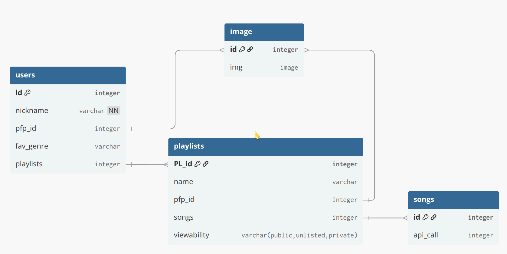

# Music_Bridge
This project's goal is to build a web app, where anyone can create, modify and publish playlist that are compatible with both Apple Music and Spotify.

The context of this project is the `Full Stack Web Developpment` course given at the HES-SO_Valais_Wallis by Mr. Guillaume Zufferey.

# BRIDGE BETWEEN APPLE MUSIC AND SPOTIFY PLAYLISTS

- Apple Music API            (I already have an account) 

- Spotify API                     (Have a friend who has a spare family slot) 

- Create commun playlists for both platforms (bridge application) 
 

## Requierements:

### Thème libre, contraintes fonctionnelles et technologiques  

#### Login/Logout
- User accounts that have their playlists (public/unlisted/
private).

- They can create, delete, modify them.
- They can view other user playlists based on the viewability.
- Can create links for theiry playlists as read only.

#### Stockage de données (base de données) 
- Accounts -> user_id, nickname, pfp, fav_genre, playlists_fk 

- Playlists -> PL_id, name, pfp, songs_fk, viewability(pub/unl/pri) 

- 

#### Architecture client/serveur, transport des données avec GraphQL 
- Viewing, modifying and adding playlists. 

#### Accès à des données externes via une API (en principe REST) 
- Songs: (only songs that are both on apple music and Spotify can be added (otherwise not much point))  

- through api gather -> pfp, name, album, artist, genre, duration 

### Frameworks et outils 

##### Front-End: Vite.js, React, Material UI, HTML, CSS 
Profiles, playlist modification and user search menus. 

##### Back-End: Express.js, Node.js, GraphQL 
Handles the interface updates, the entire DB and API calls. 

##### Déploiement avec Netlify 
For sure. 

##### APIs
Spotify and Apple Music. 

