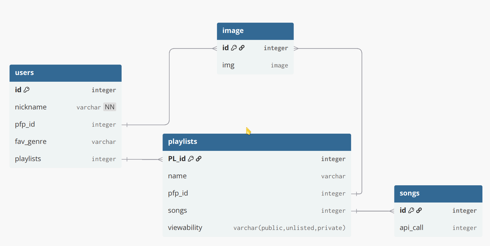

# MusicBridge
This project's original goal was to build a web app, where anyone can create, modify and publish playlists that are compatible with both Apple Music and Spotify.

However apple requires a yearly payment for API requests, and so it was decided with great regret that it will only be a web app, where users can sign up, create and customize their profile and add playlists.

The context of this project is the `Full Stack Web Developpment` course given at the HES-SO_Valais_Wallis by Mr. Guillaume Zufferey.

# Setup

## Start backend sever
Create the database (already seeded for demo purposes)\
`node backend/server.js`

## Start backend sever
`cd frontend`\
To launch locally\
`npm run dev`
To launch on an open port\
`npm run dev-remote`

## Project requirements:
### Thème libre, contraintes fonctionnelles et technologiques  
#### Login/Logout
- User accounts that have their playlists (public/private).

- They can create, delete, modify them.
- They can view other user playlists based on the viewability.
- Can create links for theiry playlists as read only (unique url for each user and playlist).

#### Stockage de données (base de données) 
- Accounts -> _id, nickname, email, bio, fav_genre, pfp, playlists_list 

- Playlists -> PL_id, name, pfp, songs_fk, viewability(pub/unl/pri) 

<!--  -->

#### Architecture client/serveur, transport des données avec GraphQL 
- Viewing, modifying and adding playlists. 

#### Accès à des données externes via une API (en principe REST) 
- Spotify API
- Create playlists with songs available on Spotify
- Through API gather -> pfp, name, album, artist, duration 

### Frameworks et outils 

##### Front-End: Vite.js, React, HTML, CSS 
Profiles, playlist modification and user search menus. 

##### Back-End: Express.js, Node.js, GraphQL 
Handles the interface updates, the entire DB and API calls. 

##### Déploiement avec Netlify 
For sure. 

# Notes
#### Exam test test.js
in backend/ => run `node test.js` => new terminal => `curl -X GET http://localhost:3000/test` => check node terminal for 3 logs.
#### Auth tutorial
Got a great tutorial from this website: `https://supertokens.com/blog/building-a-login-screen-with-react-and-bootstrap`
